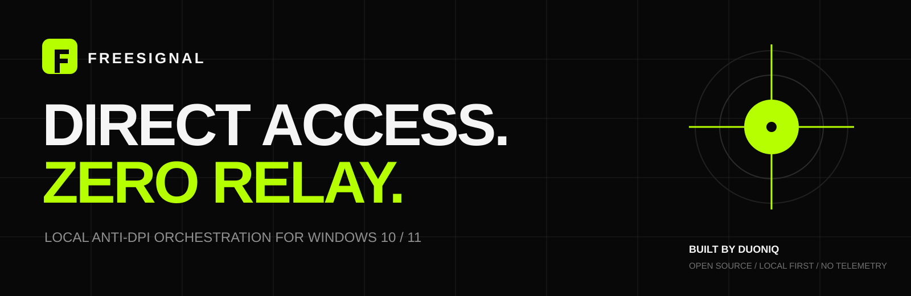
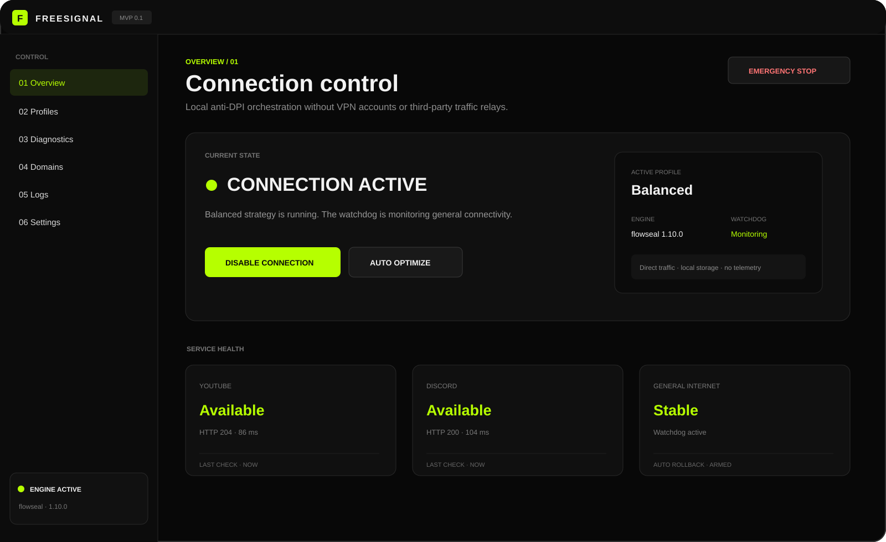

<p align="center">
  
</p>

<p align="center">
  <strong>One clear control surface for the zapret ecosystem.</strong>
</p>

<p align="center">
  <a href="https://github.com/richmanstudio/freesignal/actions/workflows/ci.yml"></a>
  
  
  
</p>

FreeSignal is an open-source Windows control client for installing, diagnosing and operating compatible **zapret** anti-DPI engine packages without forcing ordinary users to work with long command lines and dozens of batch files.

It is **not a VPN or hosted proxy**. FreeSignal does not run traffic relay servers, change the user's public IP, collect browsing history or create an account.

<p align="center">
  
</p>

## MVP capabilities

- Modern WPF desktop interface for Windows 10 and 11.
- Automatic Russian/English interface selection with a saved language preference.
- Console-free `FreeSignal.vbs` launcher and branded Windows icon.
- One-button enable/disable and independent emergency stop.
- Direct installation from the official Flowseal GitHub Releases API.
- Manual ZIP import for auditable/offline package workflows.
- SHA-256 fingerprint for every downloaded or imported archive.
- ZIP path-traversal, entry-count and expanded-size validation before extraction.
- Atomic package update with one retained rollback copy.
- Human-readable profiles mapped to visible strategy files.
- Sanitized runtime wrapper that extracts only the `winws.exe` launch block and never invokes the package service menu.
- Managed-process ownership: ordinary stop/watchdog actions never terminate another tool's `winws` process.
- Automatic profile benchmark with a general-connectivity safety gate.
- Separate watchdog process that stops the engine after repeated connectivity failure.
- DNS, service endpoint, driver signature and conflict diagnostics.
- User include/exclude domain lists.
- Visible Windows scheduled-task auto-start.
- Local operational logs and privacy-preserving support report.
- No telemetry, advertisement SDK or automatic antivirus exclusions.

## Quick start

Requirements:

- Windows 10 or Windows 11 x64;
- Windows PowerShell 5.1 or newer;
- administrator access for the packet-diversion driver.

```powershell
git clone https://github.com/richmanstudio/freesignal.git
cd freesignal
.\FreeSignal.vbs
```

`FreeSignal.cmd` remains available for troubleshooting from a terminal.

On the first launch:

1. Open **Settings**.
2. Select **Install / Update**.
3. Review the downloaded release version and SHA-256 fingerprint.
4. Return to **Overview** and select **Enable connection**.
5. Use **Auto optimize** when the default Balanced profile is not effective.

FreeSignal downloads the engine package directly from the repository declared in `app/engine-sources.json`. No DUONIQ server is involved.

## Profiles

| Profile | Purpose | Risk |
| --- | --- | --- |
| Balanced | Recommended daily YouTube/Discord/general profile | Low |
| Compatibility | Conservative alternative for provider-specific issues | Low |
| Aggressive | Stronger strategy for difficult DPI configurations | Medium |
| Simple Fake | Minimal strategy with fewer moving parts | Low |
| Experimental | Newest imported community strategy | High |

## Safety model

FreeSignal is intentionally conservative:

- it never disables antivirus or Windows security features;
- it does not make automatic firewall exclusions;
- it does not execute package service/update hooks;
- it refuses to take ownership of unrelated `winws` processes;
- it validates imported ZIP paths and size limits before extraction;
- it keeps one previous engine package for rollback;
- it exposes emergency stop and safe-mode launchers;
- it stores state and logs locally in `%LOCALAPPDATA%\FreeSignal`;
- it has no hidden telemetry.

Read the full threat model in [`docs/THREAT_MODEL.md`](docs/THREAT_MODEL.md).

## Engine package policy

The FreeSignal repository does **not** bundle third-party engine binaries. The client can download a compatible package from the source declared in `app/engine-sources.json`, currently the official Flowseal release channel, or import a local ZIP selected by the user.

FreeSignal records:

- source/provider;
- release version;
- asset URL;
- installation timestamp;
- SHA-256 of the archive.

Imported scripts are not executed directly. FreeSignal derives a minimal runtime wrapper from the selected strategy and accepts only the visible `winws.exe` launch block after rejecting forbidden hooks and command operators.

## Architecture

```text
FreeSignal.vbs / FreeSignal.cmd
             │
             ▼
        FreeSignal.ps1
             │
   ┌─────────┼───────────┬──────────────┐
   ▼         ▼           ▼              ▼
WPF UI   Engine store  Diagnostics   Watchdog
             │
             ▼
      Sanitized strategy
             │
             ▼
      winws + WinDivert
```

The GUI and orchestration logic are first-party FreeSignal code. Compatible anti-DPI engines, packet-diversion drivers and community strategies remain separate third-party works under their own licenses.

See [`docs/ARCHITECTURE.md`](docs/ARCHITECTURE.md) and [`THIRD_PARTY_NOTICES.md`](THIRD_PARTY_NOTICES.md).

## Repository layout

```text
FreeSignal.ps1              Application, UI orchestration and engine manager
FreeSignal.vbs              Console-free launcher
FreeSignal.cmd              Terminal launcher
FreeSignal-SafeMode.cmd     Independent recovery launcher
app/MainWindow*.xaml        English and Russian WPF interfaces
app/Watchdog.ps1            Independent connectivity watchdog
app/profiles.json           Human-readable strategy profile registry
app/engine-sources.json     Engine adapters and trust boundaries
installer/                  Install and uninstall scripts
tests/                      Static safety and metadata tests
docs/                       Architecture, threat model and release process
```

## Development

Run the portable self-test on Windows:

```powershell
powershell.exe -NoProfile -ExecutionPolicy Bypass -File .\FreeSignal.ps1 -SelfTest
node .\tests\test_profiles.mjs
```

The CI workflow validates PowerShell syntax, both XAML files, profile invariants, engine-source boundaries, the strategy sanitizer and release packaging.

Build a portable archive:

```powershell
.\Build-Release.ps1 -Version 0.1.1
```

## Privacy

FreeSignal does not collect or transmit analytics. Local logs contain operational events such as package installation, selected profiles, process start/stop and diagnostic results. Support exports intentionally exclude packet payloads, browsing history and the user's include/exclude domain lists.

## Attribution

FreeSignal is an independent community project and is not affiliated with the maintainers of zapret, Flowseal or WinDivert.

- Anti-DPI engine ecosystem: `bol-van/zapret` and compatible projects.
- Current packaged strategy source adapter: `Flowseal/zapret-discord-youtube`.
- Windows packet diversion used by compatible engine packages: WinDivert.

See [`THIRD_PARTY_NOTICES.md`](THIRD_PARTY_NOTICES.md) before redistribution.

## Legal notice

Network regulation differs by jurisdiction. FreeSignal is provided for lawful interoperability, availability testing, research and user-controlled network diagnostics. Users are responsible for local law, service agreements and the traffic they access.

## License

FreeSignal first-party source code is available under the [MIT License](LICENSE). Third-party engine packages, drivers and strategies are governed by their respective licenses.

---

<p align="center">
  <strong>FREESIGNAL / DUONIQ</strong><br>
  <sub>Local control. Visible changes. No account.</sub>
</p>
